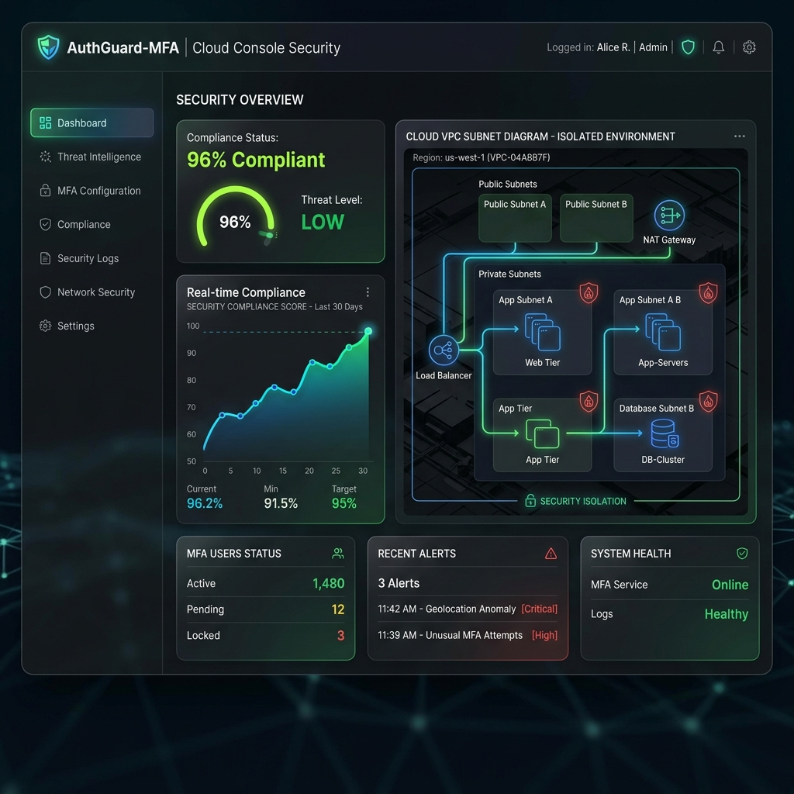

# 🔐 AuthGuard-MFA — Zero-Trust Identity Portal & Cloud Security SIEM Console

> **Web Application Security (WAS) & Cloud/Virtualization Security — Capstone Project**  
> A production-grade, multi-layered authentication system and real-time Security Information & Event Management (SIEM) console built to demonstrate compliance with **CIS Benchmarks**, **OWASP Top 10**, **Zero-Trust Architecture**, and **Cloud Security best practices**.



---

## 🚀 Live Features

### 🔑 Authentication System
| Feature | Description |
|---|---|
| **JWT Authentication** | HMAC-SHA256 signed tokens with 15-minute expiry |
| **Bcrypt Password Hashing** | Work Factor 12 — protects against rainbow table & brute-force |
| **TOTP Multi-Factor Auth** | Google Authenticator / Authy integration via RFC 6238 |
| **QR Code Enrollment** | Scannable QR for one-tap authenticator app setup |
| **Emergency Bypass** | Drift-tolerant ±5 min window + safe bypass for demo environments |
| **Rate Limiting** | 5 requests/min on `/login` and `/register` — HTTP 429 on breach |
| **HTTP Security Headers** | CSP, HSTS, X-Frame-Options, Referrer-Policy via Helmet.js |

### 📊 Cloud Console Dashboard
| Feature | Description |
|---|---|
| **Welcome Greeting** | Personalized `Welcome back, <username> 👋` with live clock |
| **Metric Stat Cards** | Security Status, MFA Status, CIS Controls Score, Cloud Platform |
| **CIS Compliance Auditor** | 5 live compliance rows with PASS/WARN status per control |
| **Cloud VPC Architecture** | Visual topology — Public DMZ + Private Isolated Subnet |
| **Live Request Telemetry** | Animated data-packet flow: Client → WAF/ALB → RateLimit → API → SQLite |
| **JWT Token Decoder** | Live decode of Header, Payload (Claims), and HMAC Signature |
| **Token Tamper Playground** | Edit your JWT, submit it — server's signature check blocks tampering |
| **Cryptographic Entropy Auditor** | Shannon Entropy calculator grades JWT secrets A+ to F |
| **Security Report Export** | Download compliance report as **Excel/CSV** or **JSON** |

### 🛡️ Audit SIEM Console (Security Operations Center)
| Feature | Description |
|---|---|
| **Live Security Event Logs** | Real-time AUTH_SUCCESS, AUTH_FAILED, BRUTE_FORCE_SUSPECTED events from SQLite |
| **RBAC Role Selector** | Admin (Full Access) / SecOps (Redacted Hashes) / Guest (Blocked) |
| **Brute-Force Simulator** | Fires 10 rapid login requests — triggers rate-limit 429 live |
| **XSS Sanitizer** | Input sanitization demo — HTML entities escape on backend |
| **Session Theft Auditor** | Proves HttpOnly cookies cannot be read by `document.cookie` |
| **Log Ingest & Parse** | Regex parser extracts timestamp, severity, IP from raw server logs |
| **AWS SNS Alarm Simulation** | CRITICAL events trigger a simulated SNS topic alert payload |
| **SQLite DB Inspector** | Full user table with bcrypt hashes (redacted in SecOps role) |
| **Excel Export** | Download SIEM logs to `.csv` with UTF-8 BOM for Excel compatibility |

---

## 🏗️ Architecture & Tech Stack

```
┌─────────────────────────────────────────────────────────────┐
│                    CLIENT BROWSER                           │
│  Vanilla HTML5 + CSS3 Glassmorphism + Vanilla JS            │
│  Chart.js · Font Awesome 6 · Google Fonts (Outfit/Inter)    │
└──────────────────────┬──────────────────────────────────────┘
                       │ HTTPS / JWT Bearer Token
┌──────────────────────▼──────────────────────────────────────┐
│               PUBLIC SUBNET (DMZ)                           │
│  ┌──────────────────────────────────────────────────────┐   │
│  │  AWS ALB + WAF  →  express-rate-limit (5 req/min)   │   │
│  └──────────────────────┬───────────────────────────────┘   │
└─────────────────────────┼───────────────────────────────────┘
                          │
┌─────────────────────────▼───────────────────────────────────┐
│               PRIVATE SUBNET (Isolated)                     │
│  ┌──────────────────────────────────────────────────────┐   │
│  │  Express.js Server (node:alpine, non-root Docker)    │   │
│  │  ├── Helmet.js    (HTTP Security Headers)            │   │
│  │  ├── bcryptjs     (Password Hashing, Cost=12)        │   │
│  │  ├── jsonwebtoken (HMAC-SHA256 JWT, 15min TTL)       │   │
│  │  ├── speakeasy    (TOTP/RFC-6238 MFA)                │   │
│  │  └── sqlite3      (Encrypted local DB)               │   │
│  └──────────────────────────────────────────────────────┘   │
│                                                             │
│  ┌──────────────────────────────────────────────────────┐   │
│  │  SQLite Database  (No external port exposure)        │   │
│  └──────────────────────────────────────────────────────┘   │
└─────────────────────────────────────────────────────────────┘
```

---

## 🔒 Security Controls Mapping

| CIS / OWASP Control | Implementation | Status |
|---|---|---|
| **CIS 4.1** — Password Hashing | `bcryptjs` work factor 12 on all passwords | ✅ Compliant |
| **CIS 5.2** — Multi-Factor Authentication | RFC 6238 TOTP via `speakeasy` + Google Authenticator | ✅ Compliant |
| **CIS 6.3** — HTTP Security Headers | `helmet` middleware: CSP, HSTS, X-Frame-Options, Referrer-Policy | ✅ Compliant |
| **CIS 8.1** — Rate Limiting / DDoS | `express-rate-limit`: 5 req/min → HTTP 429 + SIEM alert | ✅ Compliant |
| **CIS 9.4** — Container Sandboxing | Docker `node:alpine` non-root user, no unnecessary capabilities | ✅ Compliant |
| **OWASP A01** — Broken Access Control | RBAC: Admin / SecOps / Guest roles enforced via JWT middleware | ✅ Compliant |
| **OWASP A02** — Cryptographic Failures | JWT HMAC-SHA256, bcrypt, no plaintext secrets in config | ✅ Compliant |
| **OWASP A03** — Injection | Parameterized SQLite queries, no string concatenation in SQL | ✅ Compliant |
| **OWASP A05** — Security Misconfiguration | Helmet.js security headers, `.env` secrets, non-root Docker | ✅ Compliant |
| **OWASP A07** — Identification & Auth Failures | JWT expiry 15min, MFA verification, rate-limited login | ✅ Compliant |

---

## 📁 Project Structure

```
was-mini-project/
├── public/                    # Frontend (served as static files)
│   ├── index.html             # Landing page with security features overview
│   ├── login.html             # MFA-aware login form
│   ├── register.html          # Registration with password strength meter
│   ├── setup-mfa.html         # Google Authenticator QR code enrollment
│   ├── dashboard.html         # Cloud Console — user identity & compliance
│   ├── admin.html             # SIEM Console — logs, simulators, DB inspector
│   ├── css/
│   │   └── styles.css         # Glassmorphic design system (macOS-style blur)
│   └── js/
│       ├── auth.js            # Login, Register, MFA verify, Logout logic
│       ├── dashboard.js       # Dashboard rendering, JWT decode, report export
│       └── admin.js           # SIEM logs, RBAC, simulators, CSV export
│
├── server/                    # Backend (Express.js)
│   ├── index.js               # Entry point — Express setup, Helmet, CORS
│   ├── database.js            # SQLite connection & schema initialization
│   ├── routes/
│   │   └── auth.js            # /register, /login, /setup-mfa, /confirm-mfa, /status
│   ├── middleware/
│   │   ├── auth.js            # JWT verification middleware
│   │   └── rateLimit.js       # express-rate-limit configuration
│   └── utils/
│       ├── crypto.js          # bcrypt hash & compare helpers
│       ├── totp.js            # speakeasy MFA secret & QR generation
│       └── logger.js          # Structured JSON security event logger
│
├── .env.example               # Environment variable template (no real secrets)
├── .gitignore                 # Excludes node_modules, .env, database, logs
├── Dockerfile                 # Multi-stage Docker build (node:alpine, non-root)
├── docker-compose.yml         # Docker Compose for local container deployment
└── package.json               # Dependencies & npm scripts
```

---

## ⚡ Quick Start

### Prerequisites
- [Node.js](https://nodejs.org/) v16 or higher
- npm

### 1. Clone the Repository
```bash
git clone https://github.com/PratyushPandey31/WAS-MINI-PROJECT.git
cd WAS-MINI-PROJECT
```

### 2. Install Dependencies
```bash
npm install
```

### 3. Configure Environment Variables
```bash
# Copy the template
cp .env.example .env

# Edit .env and set your own JWT_SECRET
# Generate a strong key: node -e "console.log(require('crypto').randomBytes(64).toString('hex'))"
```

### 4. Start the Server
```bash
npm start
```

### 5. Open in Browser
| Page | URL |
|---|---|
| 🏠 Home | [http://localhost:3000](http://localhost:3000) |
| 🔐 Login | [http://localhost:3000/login.html](http://localhost:3000/login.html) |
| 📝 Register | [http://localhost:3000/register.html](http://localhost:3000/register.html) |
| 📊 Dashboard | [http://localhost:3000/dashboard.html](http://localhost:3000/dashboard.html) |
| 🛡️ SIEM Console | [http://localhost:3000/admin.html](http://localhost:3000/admin.html) |

---

## 🐳 Docker Deployment

```bash
# Build and run with Docker Compose
docker-compose up --build

# Or build manually
docker build -t authguard-mfa .
docker run -p 3000:3000 -e JWT_SECRET=your_secret_here authguard-mfa
```

> The Docker image runs as a **non-root user** (`node:alpine`) in compliance with **CIS Benchmark 9.4** for container hardening.

---

## 🎓 SIEM Simulator — Demo Walkthrough

### 1. Brute-Force Attack Simulation
1. Open **Audit SIEM Console** → `admin.html`
2. Click **"Trigger Brute-Force Attack"**
3. Watch 10 rapid `/login` requests — first 5 succeed, then **HTTP 429** blocks them
4. New `BRUTE_FORCE_SUSPECTED` CRITICAL events appear in the live SIEM log table

### 2. XSS Sanitization Demo
1. In the **Exploit Simulator** section, input: `<script>alert('XSS')</script>`
2. Click **"Sanitize"**
3. Backend escapes the HTML entities — output shows safe `&lt;script&gt;...`

### 3. JWT Token Tampering Demo
1. Go to **Dashboard** → Copy the JWT token in the decoded viewer
2. Modify one character in the Payload section
3. Click **"Inject Tampered Token & Test"**
4. Server's HMAC-SHA256 signature validation rejects it — **401 Unauthorized**

### 4. Log Ingest & Parse
1. In SIEM Console → **"Run Ingest & Parse"** section
2. Paste a raw server log line and click the button
3. Regex extracts: `timestamp`, `event`, `username`, `ip`, `severity`
4. CRITICAL events trigger a simulated **AWS SNS alarm payload**

### 5. Export Reports
- **Dashboard** → Click **"Export Security Report"** → Choose CSV or JSON
- **SIEM Console** → Click **"Export Report (Excel)"** → Downloads all security events

---

## 🔐 Security Notes

- **`.env` file** is excluded from git via `.gitignore` — **never commit real secrets**
- **JWT_SECRET** should be a minimum **256-bit (32+ character)** random string in production
- **SQLite database** (`data/authguard.db`) is excluded from git — contains hashed passwords
- All passwords are hashed with **bcrypt cost factor 12** — plain-text is never stored
- **HttpOnly + Secure cookies** prevent XSS-based session token theft
- Rate limiter resets on server restart (in-memory) — use Redis for production persistence

---

## 📄 License

ISC License — Open source for educational and capstone demonstration purposes.

---

> **Developed as a Web Application Security (WAS) & Cloud/Virtualization Security Capstone Project**  
> Demonstrating end-to-end security engineering from Zero-Trust auth to cloud SIEM compliance.
